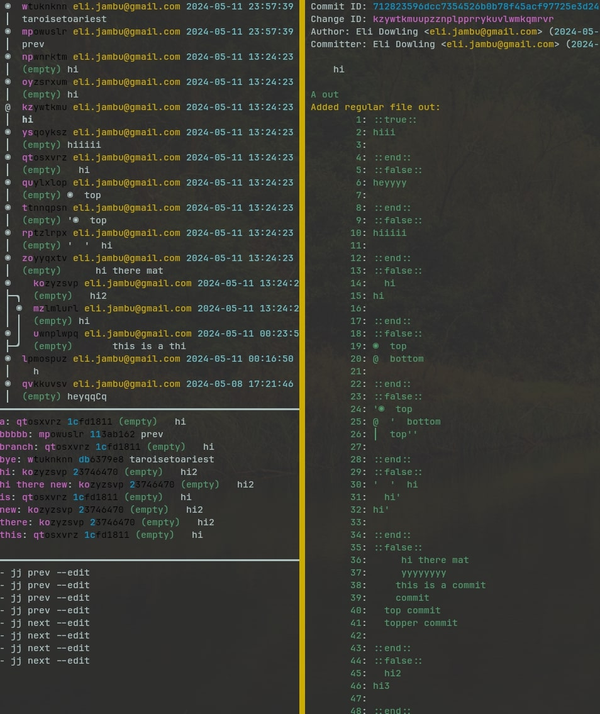

# Jujutsu TUI
A WIP TUI for the new version control system Jujutsu 

Press `h` to show the help.

Please provide any suggestions. I'm new to jujutsu so I'm sure people have workflows I couldn't even dream of.  
## Installing
To open a shell with nix:`nix shell github:faldor20/jj_tui`

To install without nix:
1. Install opam with your package manager
2. clone the repo
3. Run: `opam install .`

## Dependencies
The jujutsu CLI.
I haven't tested on windows or Mac.
I believe it won't work outside Unix so Windows users will currently have to use wsl. 

# Dev
Can be built with nix `nix build` or open a nix shell with `nix develop`
For non-nix the project can be buit with dune or opam. 
I've used opam-monorepo as an experiment, that can be built using ` dune build jj_tui`
